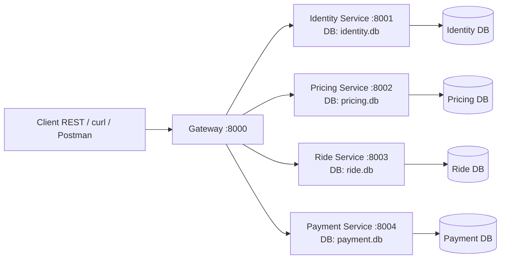

# RideNow - Projet 3 Microservices

Preuve de concept microservices pour le cas d'étude **RideNow** du cours **MGL7361**.

## Objectif couvert
Cette solution démontre :
- Une **décomposition en services autonomes** ;
- Une **communication REST/JSON** entre services ;
- Une **persistance locale par service** avec SQLite distincte ;
- Des **effets observables** via réponses HTTP, logs et écritures en base ;
- Un **déclenchement manuel clair** via le gateway REST.

## Services
- **Gateway** : point d'entrée de démonstration, orchestration du flux nominal, timeout/retry basiques.
- **Identity** : passagers, chauffeurs, disponibilité.
- **Pricing** : prix fixes par zones.
- **Ride** : cycle de vie de la course.
- **Payment** : autorisation et capture de paiement mock.

## Diagramme d'architecture


## Flux nominal
1. `POST /demo/request-ride` sur le gateway.
2. Gateway valide le passager via **Identity**.
3. Gateway cherche un chauffeur disponible via **Identity**.
4. Gateway calcule le prix via **Pricing**.
5. Gateway crée la course via **Ride** avec statut `ASSIGNED`.
6. Gateway autorise le paiement via **Payment**.
7. Gateway réserve le chauffeur via **Identity** (`available=false`).
8. L'utilisateur fait progresser la course : `ACCEPTED` → `STARTED` → `COMPLETED`.
9. À `COMPLETED`, le gateway capture le paiement puis libère le chauffeur.

## Lancement
```bash
docker compose up --build
```

## Endpoints de démonstration
### Gateway
- `GET /health`
- `GET /demo/services`
- `POST /demo/request-ride`
- `PATCH /demo/rides/{ride_id}/status`
- `GET /demo/rides/{ride_id}`

### Exemple de scénario nominal
Créer une course :
```bash
curl -X POST http://localhost:8000/demo/request-ride \
  -H "Content-Type: application/json" \
  -d '{"passenger_id":100,"from_zone":"A","to_zone":"B"}'
```

Accepter la course :
```bash
curl -X PATCH http://localhost:8000/demo/rides/1/status \
  -H "Content-Type: application/json" \
  -d '{"status":"ACCEPTED"}'
```

Démarrer la course :
```bash
curl -X PATCH http://localhost:8000/demo/rides/1/status \
  -H "Content-Type: application/json" \
  -d '{"status":"STARTED"}'
```

Compléter la course :
```bash
curl -X PATCH http://localhost:8000/demo/rides/1/status \
  -H "Content-Type: application/json" \
  -d '{"status":"COMPLETED"}'
```

Lire la projection finale :
```bash
curl http://localhost:8000/demo/rides/1
```

## Observabilité
- Logs explicites par service via `logging` Python.
- Persistance locale observée dans les fichiers :
  - `identity.db`
  - `pricing.db`
  - `ride.db`
  - `payment.db`
- Documentation OpenAPI automatique disponible via :
  - `http://localhost:8000/docs`
  - `http://localhost:8001/docs`
  - `http://localhost:8002/docs`
  - `http://localhost:8003/docs`
  - `http://localhost:8004/docs`

## Robustesse minimale
- Timeout configurable côté gateway ;
- Retry simple configurable côté gateway ;
- Codes HTTP cohérents : `404`, `409`, `400`, `504`.
