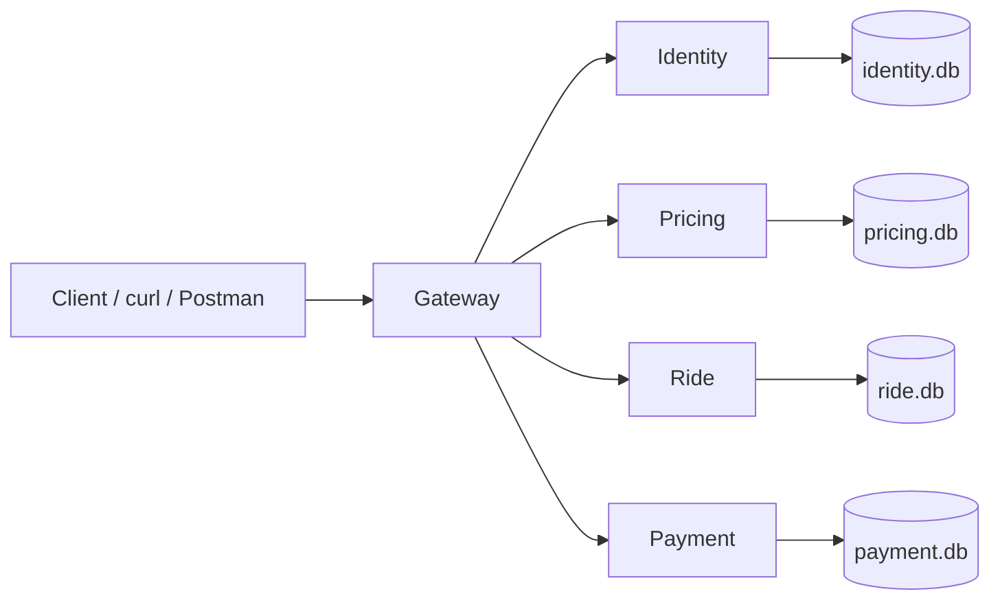

# Document d’architecture & instructions — RideNow

## 1. Vue d’ensemble architecturale
RideNow est implémenté sous forme d’une **architecture microservices** locale. Le système est découpé en quatre services métier et un gateway de démonstration.

### Services et responsabilités
- **Identity Service** : gère les passagers, les chauffeurs et l’état de disponibilité des chauffeurs.
- **Pricing Service** : calcule un prix fixe à partir des zones de départ et d’arrivée.
- **Ride Service** : gère le cycle de vie d’une course et l’état du paiement associé.
- **Payment Service** : simule l’autorisation et la capture du paiement.
- **Gateway** : reçoit le stimulus initial, orchestre le scénario nominal, expose une API simple pour la démonstration et applique des mécanismes de robustesse basiques.

### Frontières claires et propriété des données
Chaque service possède sa **base SQLite locale**, ce qui rend explicite la propriété des données et évite la base partagée :
- Identity → `identity.db`
- Pricing → `pricing.db`
- Ride → `ride.db`
- Payment → `payment.db`

Cela respecte le principe microservices : **chaque service est autonome sur ses données et son cycle de vie**.

## 2. Diagramme et flux REST
### Diagramme logique


### Séquence du flux nominal
**Stimulus initial** : un passager demande une course de `A` vers `B`.

1. Le client appelle `POST /demo/request-ride` sur le gateway.
2. Le gateway valide l’existence du passager via `GET /passengers/{id}` auprès d’Identity.
3. Le gateway recherche un chauffeur disponible dans la zone de départ via `GET /drivers?available=true&zone=A`.
4. Le gateway calcule le montant via `GET /price?from=A&to=B` auprès de Pricing.
5. Le gateway crée la course auprès de Ride via `POST /rides` ; la course est créée avec le statut `ASSIGNED`.
6. Le gateway appelle Payment via `POST /payments/authorize` pour créer un paiement au statut `AUTHORIZED`.
7. Le gateway met à jour la disponibilité du chauffeur avec `PATCH /drivers/{id}/availability` et passe le chauffeur à indisponible.
8. Ensuite, l’utilisateur fait avancer la course manuellement par `PATCH /demo/rides/{ride_id}/status` : `ACCEPTED`, puis `STARTED`, puis `COMPLETED`.
9. À la transition `COMPLETED`, le gateway capture le paiement via `POST /payments/capture`, met à jour l’état de paiement dans Ride, puis libère le chauffeur dans Identity.

### Effets observables
- **Réponses HTTP** visibles côté client.
- **Logs** visibles dans chaque conteneur.
- **Écritures en base** visibles dans les fichiers `.db` propres à chaque service.

## 3. Contrats d’API principaux
| Service | Endpoint | Rôle | Entrée | Sortie |
|---|---|---|---|---|
| Gateway | `POST /demo/request-ride` | Déclenche le scénario nominal | `passenger_id, from_zone, to_zone` | course assignée + chauffeur + prix + paiement autorisé |
| Gateway | `PATCH /demo/rides/{id}/status` | Fait progresser la course | `status` | course mise à jour + effets associés |
| Gateway | `GET /demo/rides/{id}` | Vue agrégée | id | course + chauffeur + paiement |
| Identity | `GET /drivers` | Liste des chauffeurs | `available`, `zone` | liste JSON |
| Identity | `PATCH /drivers/{id}/availability` | Change la disponibilité | `available` | chauffeur mis à jour |
| Pricing | `GET /price` | Retourne le prix d’une course | `from`, `to` | `{ amount }` |
| Ride | `POST /rides` | Crée une course | ids + zones + montant | course créée |
| Ride | `PATCH /rides/{id}/status` | Change l’état métier | `status` | course mise à jour |
| Payment | `POST /payments/authorize` | Autorise un paiement | `ride_id`, `amount` | paiement `AUTHORIZED` |
| Payment | `POST /payments/capture` | Capture un paiement | `ride_id` | paiement `CAPTURED` |

## 4. Robustesse minimale
Le projet inclut des mécanismes simples mais visibles :
- **Timeouts** côté gateway pour limiter l’attente en cas de service indisponible ;
- **Retry simple** côté gateway pour absorber une erreur réseau temporaire ;
- **Codes d’erreur HTTP explicites** :
  - `404` si ressource absente,
  - `400` si entrée invalide,
  - `409` si conflit métier (ex. transition illégale, aucun chauffeur),
  - `504` si un service amont ne répond pas dans le délai.

## 5. Démarrage & validation
### Prérequis
- Docker Desktop installé
- Docker Compose disponible

### Étapes de lancement
Depuis le dossier du projet :
```bash
docker compose up --build
```

### Déclenchement du scénario
Créer une course :
```bash
curl -X POST http://localhost:8000/demo/request-ride \
  -H "Content-Type: application/json" \
  -d '{"passenger_id":100,"from_zone":"A","to_zone":"B"}'
```

Transitions manuelles :
```bash
curl -X PATCH http://localhost:8000/demo/rides/1/status -H "Content-Type: application/json" -d '{"status":"ACCEPTED"}'
curl -X PATCH http://localhost:8000/demo/rides/1/status -H "Content-Type: application/json" -d '{"status":"STARTED"}'
curl -X PATCH http://localhost:8000/demo/rides/1/status -H "Content-Type: application/json" -d '{"status":"COMPLETED"}'
```

### Où observer les résultats
- **Réponses HTTP** : terminal/curl ou Postman.
- **Logs** : sortie des conteneurs Docker (`gateway`, `identity`, `pricing`, `ride`, `payment`).
- **Données persistées** : dans chaque base SQLite locale du service correspondant.

## 6. Alignement avec les critères d’évaluation
- **Qualité architecturale** : frontières nettes, contrats REST simples, données non partagées.
- **Qualité d’implémentation** : scénario nominal complet, stimulus simple via gateway, persistance observable, journaux utiles, erreurs gérées.
